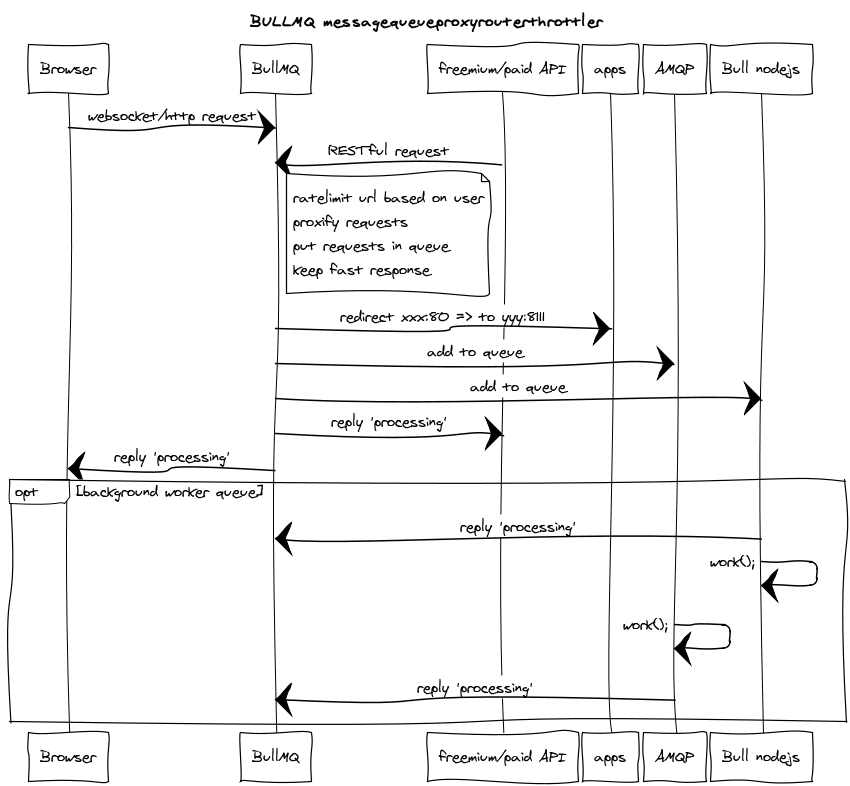

bullmq
======

a httpproxythrottlingmessagejobqueuedomainrouter.

### What is it?

Its a enormous pillow to put in front of your webserver.
Prevent server/application-panic by limiting and rerouting webrequests to different areas/servers.

### Isnt there already software for this?

There are many enterprise-ish packages out there, but I wanted something deadsimple to configure.
Next to that AMQP-support (not finished) will be able to scale out to big servicebusses like RabbitMQ e.g.

### Concept

Here's a sequencediagram (because sequencediagrams are cool :) hope it makes sense though)

### A simple configuration

Lets have a look at the conf.d/myproject.js file:

    exports.proxy = function(config){  
      config["localhost:8080"]        = ["http://127.0.0.1:80"];
      config["mydomain.org:8080"]     = ["http://127.0.0.1:80"];
      config["www.mydomain.org:8080"] = ["http://127.0.0.1:80"];
      config["ws.mydomain.org:8080"]  = ["http://127.0.0.1:8111"];
      return config;
    }

Above are domainredirects: localhost on 8080 will redirect to port 80. Other domains can 
be entered (for example ws. for websocket traffic).
Multiple arrayvalues will result in random round-robin behaviour (quickndirty scalable).
    
    exports.limiters = function(config){
      config["localhost:8080"]     = { unit: "minute", rate:90 };  // 90 requests per minute 
      config["localhost:8080/foo"] = { unit: "minute", rate:20 };  // overrides 90 with 20 
      return config;
    }

Above you can limit per domain and/or url. The units are: day,hour,minute,second.
This is handy to ensure your projects will not overload your server.
For example, one could setup 3 subdomains for api-calls: 

* `freemium.api.com` 
* `basic.api.com` 
* `premium.api.com`
* 
Just set different rates for these subdomains, and bullmq will reply to clients like so when rate are exceeded:

    {succes:false, code: 429, msg:"Too Many Requests - your IP is being rate limited",data:{}}

And now for workers:

    exports.queue = function(config){  
      config["localhost:8080"]    = {
        "/foo": { 
          queue: "/request_web",       // put '/foo' in queue 'request_web'
          timeout: 500                 // generate timeout if no redis subscribers respond within 500 milliseconds
        }      
      };
      return config;
    }
   
Here you can queue a request for later processing using nodejs bull (b2b apis/messaging/long running tasks).
If a redis- or amqp-subscriber does snot respond with a 'completed'-event to the task, bullmq will reply:

    {succes:false, code: 104, msg:"server could not handle your request in time",data:{}}

If a subscriber *does* respond within the timeout-timeframe, it can respond with a "queued", "processing" or "ok" reply.
Example: user wants to encode 4 video's, clients are firing hundreds of push requests to the databases etc.
